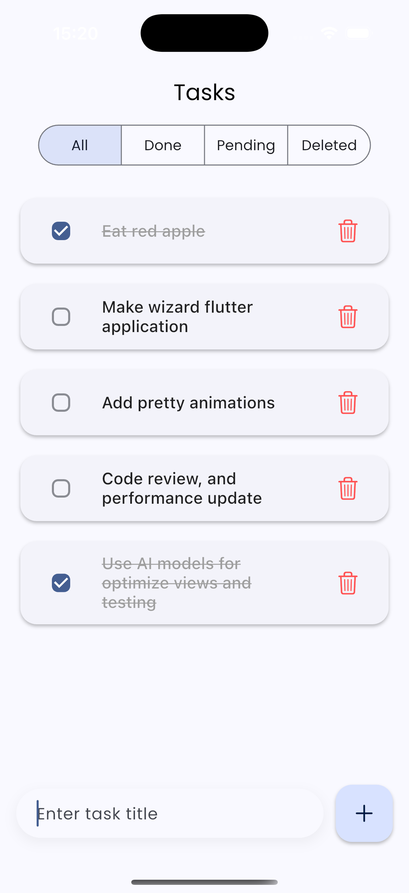
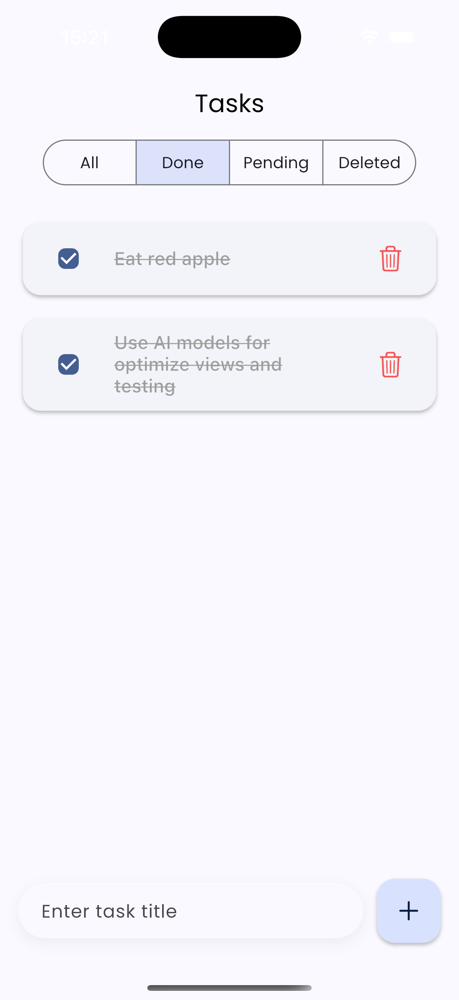
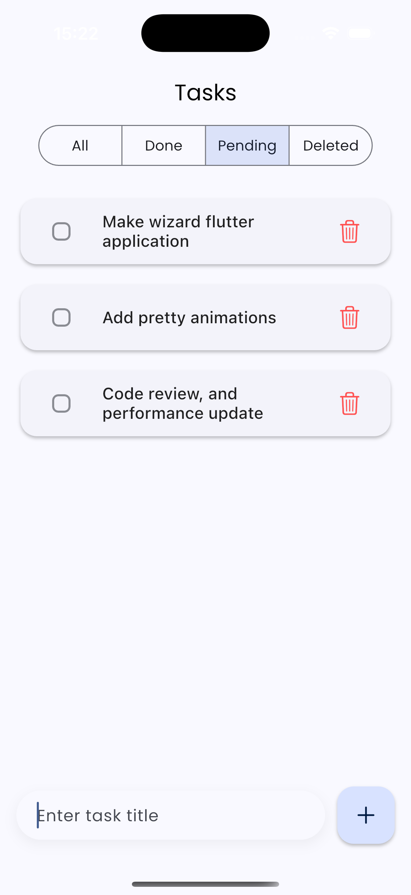
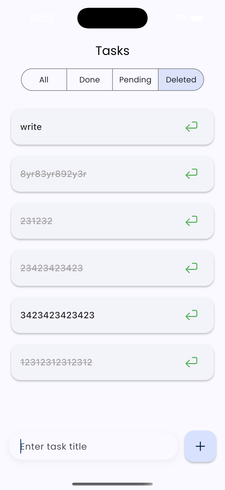

# Flutter Todo App

A minimalist, beautiful, and Bloc-powered Flutter application for managing tasks with persistent storage.

## Features

- **State Management**: Uses `flutter_bloc` for predictable state management.
- **Data Models**: robust models using `freezed` and `json_serializable`.
- **Persistence**: Saves tasks locally using `shared_preferences`.
- **Filtering**: Filter tasks by All, Completed, Pending or Deleted.
- **UI**: Modern Material 3 design.

## Screenshots

### All Tasks


### Done Tasks


### Pending Tasks


### Deleted Tasks


## Folder Structure
```
.
├── android # Android specific files
├── assets # Static assets like images
├── build # Build output
├── ios # iOS specific files
├── lib # Main Dart code
│   ├── bloc # Business Logic Components (BLoCs)
│   ├── main.dart # App entry point
│   ├── models # Data models
│   ├── services # Data persistence services
│   ├── theme # App theme data
│   └── ui
│       ├── screens # App screens
│       └── widgets # Reusable UI widgets
├── test # App tests
├── .gitignore # Git ignore file
├── analysis_options.yaml # Dart analyzer options
├── pubspec.lock # Locked dependencies
└── pubspec.yaml # App dependencies and configuration
```

## Setup & Run

1.  **Install Dependencies**
    ```bash
    flutter pub get
    ```

2.  **Generate Code**
    This project uses code generation for models. Run the following command:
    ```bash
    dart run build_runner build --delete-conflicting-outputs
    ```

3.  **Run the App**
    ```bash
    flutter run
    ```
